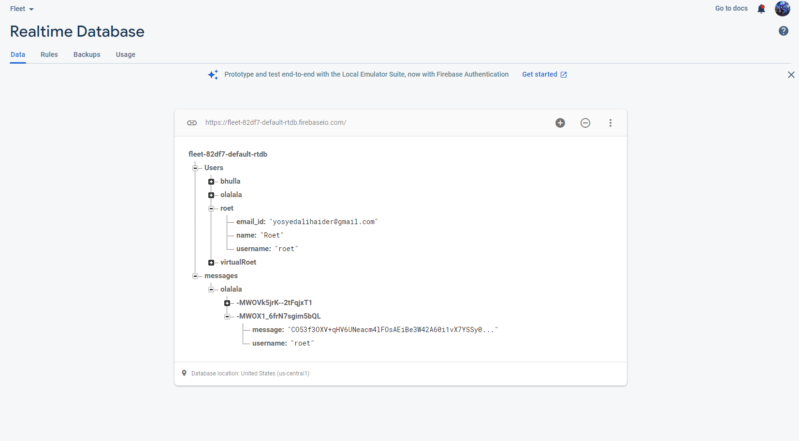
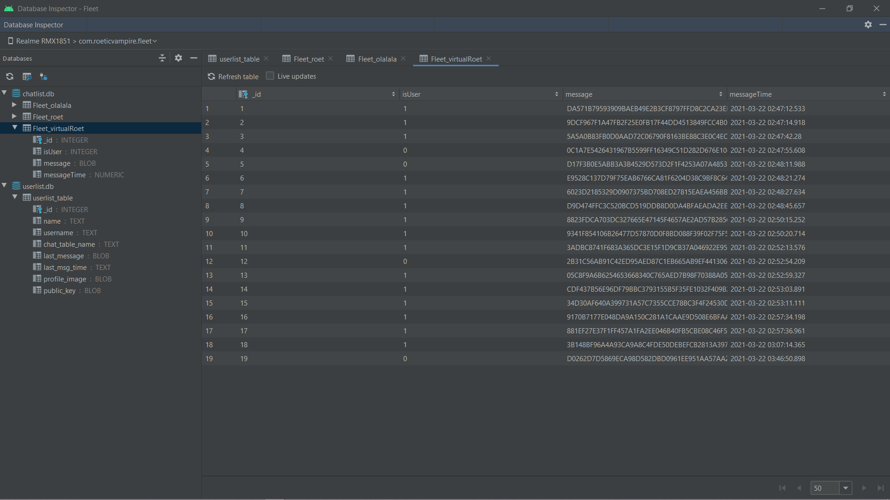

# Fleet

### Summary
Fleet is an RSA encrypted realtime chat application, based on Firebase Realtime Database.

### Key HighLights
- SQLite Database stores all the chats locally, encrypted by the user's Public Key
- Firebase Authentication for user management, alongwith Firebase Storage for online accessibility of every user's Profile Image and Public Key
- One-time KeyPair Generation at the time of registering a new account

This text you see here is *actually- written in Markdown! To get a feel
for Markdown's syntax, type some text into the left window and
watch the results in the right.

## Implementation details
- Firebase Authentication checks if the user is signed in, to ensure Firebase Databases aren't publically accessible
- The credentials of the user (excluding password) are saved in a "users" node on Realtime Database, while their profile Image and Public Key are stored in Firebase Storage
- Upon account registration, A Key Pair is generated and saved locally, alongside pushing the Public Key to the Firebase Storage
- All the contacts for the user, and their respective chats are stored locally via SQLite Databases
- The messages stored in the SQLite Database locally are all encrypted with the User's personal Public Key
- Every time the messages are accessed from the database, they are decrypted with the User's personal Private Key
- The Firebase Listener that listens for new messages, deletes each message it recieves after processing it, hence ensuring no messages are stored online once

## Important mentions

Fleet uses a number of open source projects to work properly:

- [RSA] - Clean implementation of RSA Algorithm
- [Glide] - awesome firebase image library
- [Android Image Cropper] - smooth iamge cropping library
- Friends who've helped point out bugs and crashes until the current build

#### Known Issues
- Currently the chat screen periodically refreshes the RecyclerView for new messages, instead of working via callback, which would be more efficient
Any help fixing that would be greatly appreciated

#### Test it yourself

For the signed v2 release apk:
[Fleet v1.0 apk]

#### Screenshots

- Firebase Realtime Database Snapshot

- Chats Database Snapshot

- Users Database Snapshot

#### Thanks for giving me your time xD

[//]: # (These are reference links used in the body of this note and get stripped out when the markdown processor does its job. There is no need to format nicely because it shouldn't be seen. Thanks SO - http://stackoverflow.com/questions/4823468/store-comments-in-markdown-syntax)

   
   [RSA]: <https://github.com/anujpatel/RSA-Algorithm/blob/master/RSAEncryptionDescription.java>
   [Glide]: <https://github.com/bumptech/glide>
   [Gulp]: <http://gulpjs.com>
   [Fleet v1.0 apk]: <app/release/app-release.apk>
[Android Image Cropper]:<https://github.com/ArthurHub/Android-Image-Cropper>
  
